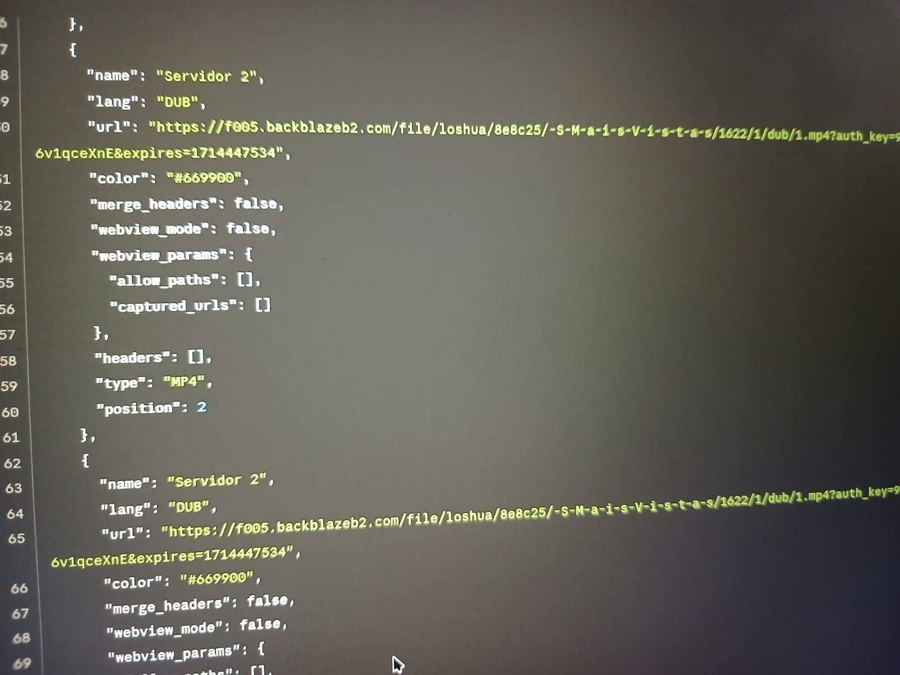
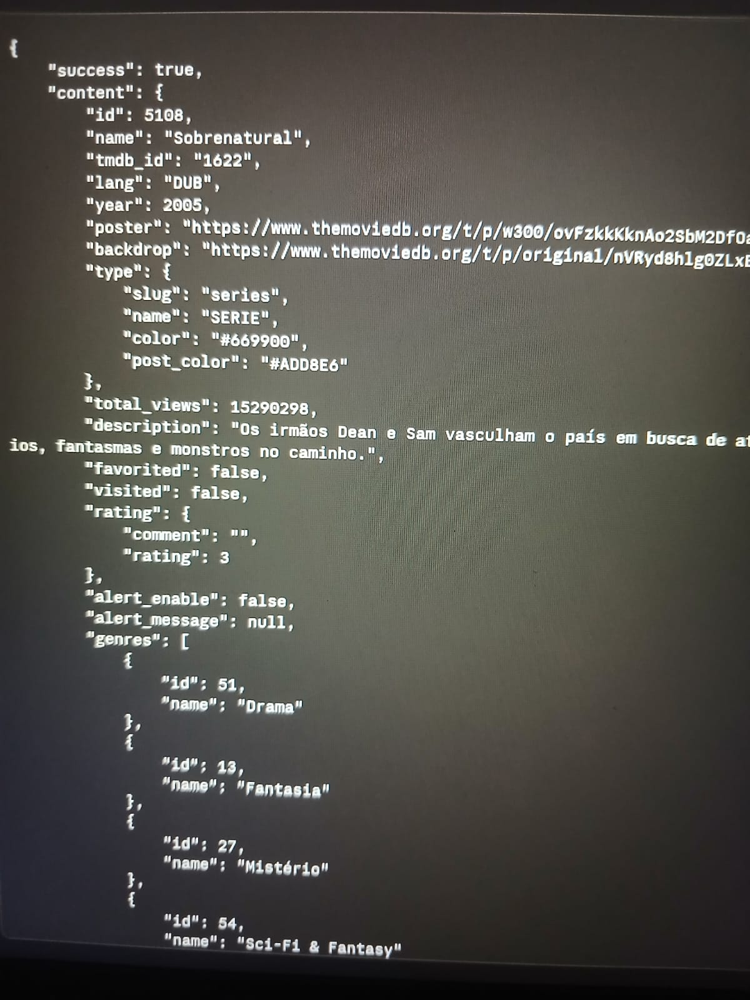
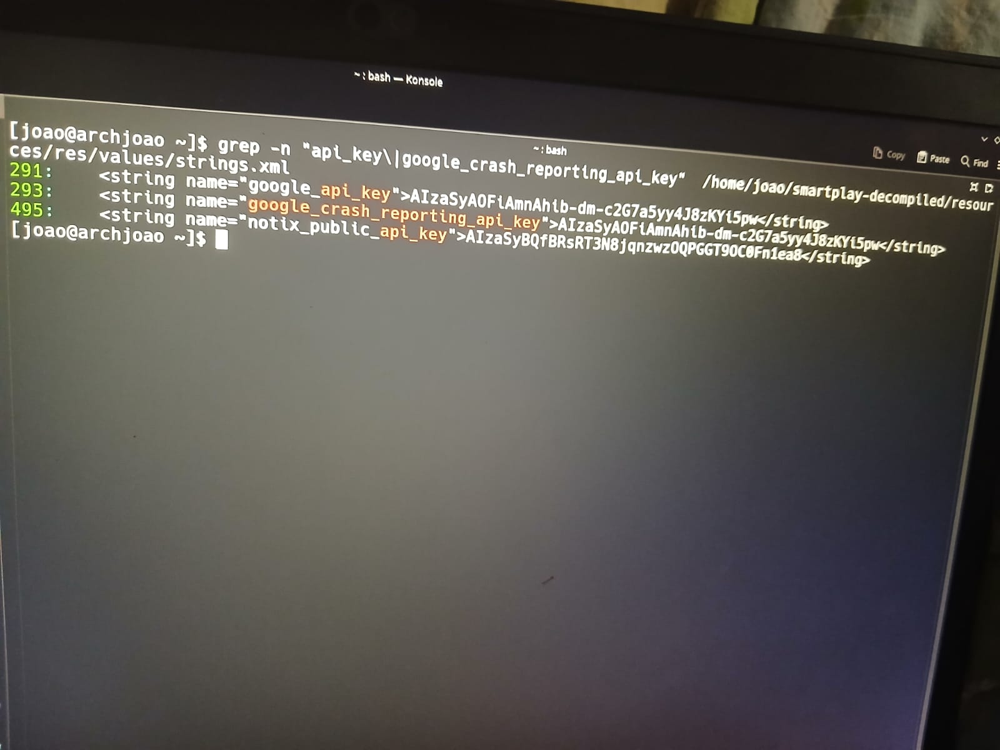
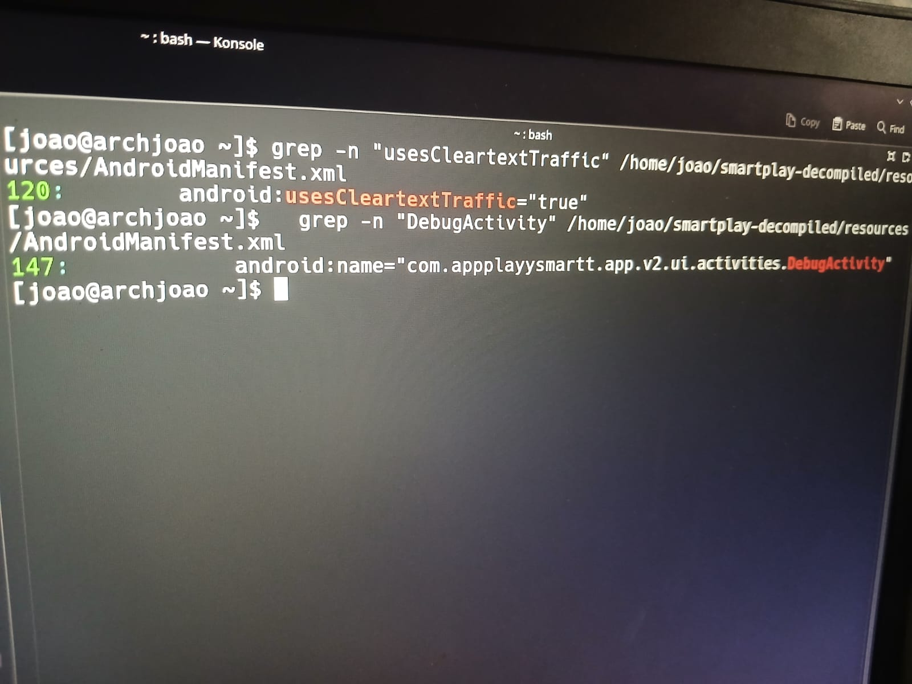
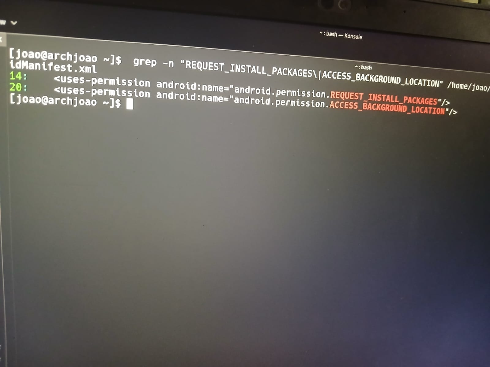

# smartplay-security-analysis
 Mobile security analysis of the Smart Play APK (v1.16) - static analysis with jadx and traffic interception with mitmproxy. Educational portfolio project.
 
  ## 1. Introdução

  O Smart Play é um aplicativo Android não oficial de streaming de conteúdo, distribuído fora
  da Play Store. A motivação inicial para esta análise foi pessoal: eu queria entender se
  havia algum parâmetro no app que permitisse alterar o idioma do catálogo. Com o avanço da
  investigação, o escopo evoluiu para uma análise de segurança mais ampla, com foco em
  identificar más práticas de desenvolvimento, dados sensíveis expostos e comportamentos
  suspeitos. Este documento registra o processo, o raciocínio por trás de cada descoberta e
  os resultados obtidos. Análise conduzida para fins educacionais, sem
  qualquer exploração maliciosa.

  ---

  ## 2. Metodologia

  Para o processo de análise foram utilizadas duas ferramentas: mitmproxy e jadx.

  O mitmproxy é uma ferramenta de proxy que intercepta requisições HTTPS posicionando-se
  entre o cliente e o servidor, capturando todo o tráfego em tempo real. Com ela, foi
  possível observar as chamadas de API do aplicativo, identificar endpoints, analisar os
  dados trafegados e mapear a infraestrutura do backend. O ambiente foi configurado com o
  mitmproxy rodando no notebook, enquanto o celular Samsung foi configurado para apontar seu
  tráfego de rede para o proxy. Para interceptar tráfego HTTPS, foi necessário instalar o
  certificado do mitmproxy no dispositivo como certificado de confiança, isso permite que o
  proxy descriptografe o tráfego sem que o app rejeite a conexão. O fato de o app não
  implementar certificate pinning foi o que tornou essa interceptação possível.

  O jadx é uma ferramenta de descompilação de APKs. Ela converte os arquivos `.dex` do pacote
  Android, código compilado para a máquina virtual do Android, de volta para código Java
  legível. Com ela, foi possível realizar análise estática do código-fonte reconstruído,
  buscando dados sensíveis, configurações e comportamentos do app sem necessitar executá-lo.

  ---

  ## 3. Análise de Tráfego

  A interceptação do tráfego com o mitmproxy revelou as seguintes descobertas:
  
  **Mapeamento da infraestrutura**
  Foi possível identificar que o backend do app é composto por Node.js como servidor de
  aplicação, Cloudflare como camada de proxy/CDN e Backblaze B2 como armazenamento dos
  arquivos de vídeo. Essa informação foi obtida diretamente dos cabeçalhos HTTP e da
  estrutura das URLs interceptadas.
  
  **URLs de stream com estrutura previsível**
  Os arquivos de vídeo são servidos diretamente do Backblaze B2 com URLs no formato
  `backblazeb2.com/.../tmdb_id/temporada/dub/episodio.mp4`. A estrutura é completamente
  previsível; qualquer pessoa com conhecimento do padrão poderia construir a URL de qualquer
  episódio sem usar o app. Isso também confirmou que o conteúdo não possui nenhuma proteção
  de acesso como tokens assinados ou URLs temporárias.

  

  **"lang": "DUB" hardcoded**
  Um dos endpoints retornou o parâmetro `"lang": "DUB"` fixo no JSON de resposta. Isso
  confirmou que não existe suporte a múltiplos idiomas ou legendas; há uma única faixa de
  áudio disponível por conteúdo, o que respondia à minha motivação inicial para a análise.

  

  **Tokens expirados ainda funcionam**
  Foi verificado que tokens de autenticação continuavam funcionando após o prazo de validade
  esperado. O impacto prático é baixo dado que o conteúdo é gratuito, mas indica ausência de
  validação de sessão server-side; má prática de segurança.

  **Endpoint de configuração expõe SDKs**
  Um endpoint de configuração retornava informações sobre os SDKs de anúncio utilizados pelo
  app. Embora seja de baixa severidade, essa exposição facilita o mapeamento da superfície de
  ataque por parte de um atacante.

  **App operado por uma única pessoa**
  O JSON de configuração continha metadados que confirmaram que o app é mantido por um único
  desenvolvedor. Esse contexto é relevante para calibrar as expectativas de segurança. Apps
  solo tendem a ter menos revisão de código e práticas de segurança menos rigorosas.

  ---

  ## 4. Análise Estática

  A análise estática foi realizada sobre o código descompilado pelo jadx, combinando leitura
  do `AndroidManifest.xml` e buscas com `grep` no código Java reconstruído e nos arquivos de
  recursos.
  
  **Chaves de API expostas**
  O arquivo `resources/res/values/strings.xml` continha chaves reais hardcoded:
  - `google_api_key` e `google_crash_reporting_api_key`: ambas com o mesmo valor
  (`AIzaSyAOFiAmnAhib...`), o que indica que a mesma chave Firebase foi reutilizada para dois
   propósitos distintos mostrando má prática que sugere descuido no gerenciamento de credenciais.
  - `notix_public_api_key`: chave do serviço de notificações push Notix.
  - `ap_lovin_key`: chave do SDK de publicidade AppLovin, que identifica a conta do publisher
  e deveria ser protegida.

  

  Chaves Firebase seguem o padrão `AIzaSy...` e são semi-públicas por design. O impacto real
  depende das regras de acesso configuradas no console do Firebase, o que não foi verificado
  nesta análise. A exposição é uma má prática documentável, mas o impacto real não pode ser
  confirmado sem teste ativo.

  **`DebugActivity` em produção**
  O `AndroidManifest.xml` declara uma activity chamada
  `com.appplayysmartt.app.v2.ui.activities.DebugActivity` na versão de produção do app. Telas
  de debug são usadas durante o desenvolvimento para inspecionar configurações internas e
  logs, e deveriam ser removidas antes da publicação. A presença dela indica que o processo
  de build não tem uma etapa de revisão antes do release.

  **Tráfego não criptografado permitido**
  A flag `usesCleartextTraffic="true"` no manifest indica que o app não força HTTPS em todas
  as conexões, permitindo comunicação HTTP sem criptografia.

  

  **Permissões excessivas**
  O manifest declara permissões desproporcionais para um app de streaming:
  - `ACCESS_COARSE_LOCATION`, `ACCESS_FINE_LOCATION` e `ACCESS_BACKGROUND_LOCATION`: não há
  justificativa legítima para um app de streaming coletar localização, especialmente em
  background, quando o app está fechado.
  - `REQUEST_INSTALL_PACKAGES`: permite instalar APKs no dispositivo. Provavelmente usada
  para auto-atualização fora da Play Store, o que é plausível dado que o app não está
  disponível na loja oficial. Ainda assim, é uma permissão de alto risco que poderia ser
  explorada para instalar software malicioso.

  
  
  ---
  
  ## 5. Conclusões e Limitações
  
  O Smart Play apresenta diversas más práticas de segurança que seriam problemáticas em um
  app que lida com dados sensíveis ou pagamentos. As descobertas mais relevantes foram a
  exposição de chaves de API no código, permissões excessivas sem justificativa clara e
  ausência de certificate pinning.
  
  É importante calibrar o impacto dessas descobertas dentro do contexto do app: o Smart Play
  é um serviço gratuito, sem coleta de dados financeiros e operado por um único 
  desenvolvedor. Isso não elimina as más práticas, mas significa que o risco real para o
  usuário final é limitado. Nenhuma vulnerabilidade foi explorada ativamente durante esta
  análise.
  
  As principais limitações desta análise são:
  - O impacto real das chaves Firebase expostas não foi verificado, pois exigiria teste ativo
  fora do escopo deste trabalho
  - A ofuscação parcial do código impediu análise completa de algumas classes
  - Não foi realizada análise dinâmica além da interceptação de tráfego
  
  ---
  
  ## 6. O que Aprendi
  
  Esta análise me proporcionou experiência prática em duas frentes distintas da segurança
  mobile.
  
  Na análise dinâmica, aprendi na prática como configurar um proxy manualmente e entendi de
  forma concreta como funciona o processo de interceptação HTTPS - o que significa estar 
  entre o cliente e o servidor, quais informações o tráfego revela e por que a ausência de
  certificate pinning é relevante do ponto de vista de segurança.
  
  Na análise estática, entendi como funciona o processo de descompilação de um APK e o que é
  possível extrair de um app sem executá-lo. Aprendi que ferramentas simples como `grep` e 
  `find`, usadas com critério e um olhar atento aos detalhes, são suficientes para revelar
  informações sensíveis que o desenvolvedor não percebeu que estava expondo.
  
  De forma mais ampla, essa investigação me deu uma visão prática de como é conduzida uma
  análise de segurança mobile, desde a configuração do ambiente até a documentação dos
  achados, e estabeleceu uma base sólida para análises mais aprofundadas no futuro.
  
  ---
  
  *Análise realizada em ambiente controlado para fins educacionais. Nenhuma informação obtida
   foi utilizada de forma maliciosa.*
